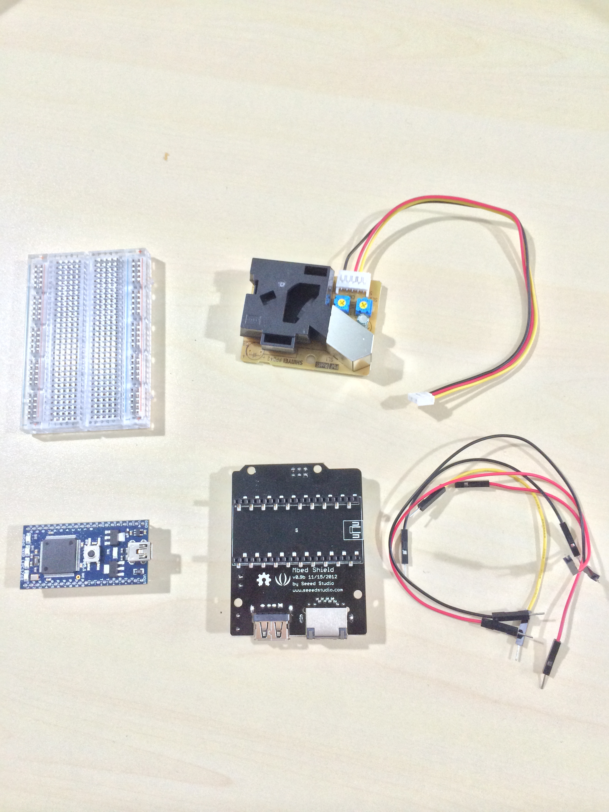
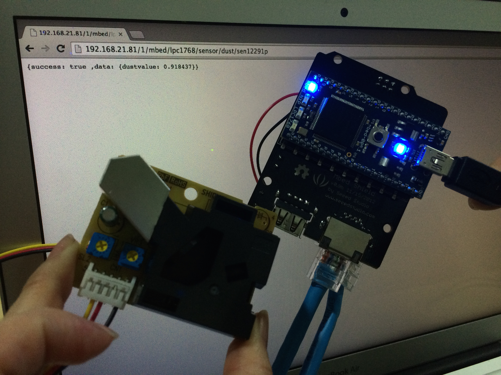

# 第 5 章：DIY 空氣品質偵測器

## 準備工作

### LPC1768 的 GPIO Pinout

LPC1768 的 GPIO（General purpose digital input/output）pin 共分為 Port 0、Port 1、Port 2、Port 3 四類。

Port 0 簡介：

* Port 0 代表編號 P0[0]～P0[31] 的所有 GPIO pin。

* Port 0 與 ARM mbed pin 的對應關係如下：

 * P0[0]：p9
 * P0[1]：p10
 * P0[2]： -
 * P0[3]： -
 * P0[4]：p30
 * P0[5]：p29
 * P0[6]：p8
 * P0[7]：p7
 * P0[8]：p6 
 * P0[9]：p5
 * P0[10]：p28
 * P0[11]：p27
 * P0[12]：N/A
 * P0[13]：N/A
 * P0[14]：N/A
 * P0[15]：p13
 * P0[16]：p14
 * P0[17]：p12
 * P0[18]：p11
 * P0[19]： -
 * P0[20]： -
 * P0[21]： -
 * P0[22]： -
 * P0[23]：p15
 * P0[24]：p16
 * P0[25]：p17
 * P0[26]：p18
 * P0[27]： -
 * P0[28]： -
 * P0[29]：USB+
 * P0[30]：USB-
 * P0[31]：N/A

“-”：表示沒有特殊對應之 ARM mbed pin，但仍為 GPIO pin。
“N/A“：表示 Not available。
 
* Port 0 是一個 32-bit 的 I/O port，每一個 bit 都能直接被控制。Port 0 所有 pin 的操作取決於 pin connect block 選出的功能。

* Port 0 的 P0[12]、P0[13]、P0[14]、P0[31] 這 4 支 pin 無法使用。


Port 1 簡介：

* Port 1 代表編號 P1[0]～P1[31] 的所有 GPIO pin。

* Port 1 與 ARM mbed pin 的對應關係如下：

 * P1[0]： -
 * P1[1]： -
 * P1[2]：N/A
 * P1[3]：N/A
 * P1[4]： -
 * P1[5]：N/A
 * P1[6]：N/A
 * P1[7]：N/A
 * P1[8]： -
 * P1[9]： -
 * P1[10]： -
 * P1[11]：N/A
 * P1[12]：N/A
 * P1[13]：N/A
 * P1[14]： -
 * P1[15]： -
 * P1[16]： -
 * P1[17]： -
 * P1[18]：LED1
 * P1[19]： - 
 * P1[20]：LED2 
 * P1[21]：LED3 
 * P1[22]： - 
 * P1[23]：LED4
 * P1[24]： -
 * P1[25]： -
 * P1[26]： -
 * P1[27]： - 
 * P1[28]： -
 * P1[29]： - 
 * P1[30]：p19
 * P1[31]：p20

“-”：表示沒有特殊對應之 ARM mbed pin，但仍為 GPIO pin。
“N/A“：表示 Not available。

* Port 1 是一個 32-bit 的 I/O port，每一個 bit 都能直接被控制。Port 1 所有 pin 的操作取決於 pin connect block 選出的功能。

* Port 1 的 P1[2]、P1[3]、P1[5]、P1[6]、P1[7]、P1[11]、P1[12]、P1[13] 這 8 支 pin 無法使用。


Port 2 簡介：

* Port 2 代表編號 P2[0]～P2[31] 的所有 GPIO pin。

* Port 2 與 ARM mbed pin 的對應關係如下：

 * P2[0]：p26 
 * P2[1]：p25 
 * P2[2]：p24
 * P2[3]：p23
 * P2[4]：p22 
 * P2[5]：p21
 * P2[6]： -
 * P2[7]： -
 * P2[8]： - 
 * P2[9]： - 
 * P2[10]： -
 * P2[11]： -
 * P2[12]： -
 * P2[13]： -
 * P2[14]：N/A 
 * P2[15]：N/A 
 * P2[16]：N/A 
 * P2[17]：N/A 
 * P2[18]：N/A
 * P2[19]：N/A 
 * P2[20]：N/A
 * P2[21]：N/A
 * P2[22]：N/A 
 * P2[23]：N/A
 * P2[24]：N/A 
 * P2[25]：N/A 
 * P2[26]：N/A 
 * P2[27]：N/A 
 * P2[28]：N/A 
 * P2[29]：N/A 
 * P2[30]：N/A
 * P2[31]：N/A

“-”：表示沒有特殊對應之 ARM mbed pin，但仍為 GPIO pin。
“N/A“：表示 Not available。

* Port 2 是一個 32-bit 的 I/O port，每一個 bit 都能直接被控制。Port 2 所有 pin 的操作取決於 pin connect block 選出的功能。

* Port 2 的 P2[14]～P2[31] 這 18 支 pin 無法使用。


Port 3 簡介：

* Port 3 代表編號 P3[0]～P3[31] 的所有 GPIO pin。

* Port 3 與 ARM mbed pin 的對應關係如下：

 * P3[0]：N/A
 * P3[1]：N/A
 * P3[2]：N/A
 * P3[3]：N/A
 * P3[4]：N/A
 * P3[5]：N/A
 * P3[6]：N/A 
 * P3[7]：N/A
 * P3[8]：N/A 
 * P3[9]：N/A 
 * P3[10]：N/A 
 * P3[11]：N/A 
 * P3[12]：N/A 
 * P3[13]：N/A 
 * P3[14]：N/A
 * P3[15]：N/A
 * P3[16]：N/A
 * P3[17]：N/A
 * P3[18]：N/A
 * P3[19]：N/A
 * P3[20]：N/A
 * P3[21]：N/A
 * P3[22]：N/A
 * P3[23]：N/A
 * P3[24]：N/A
 * P3[25]： -
 * P3[26]： -
 * P3[27]：N/A
 * P3[28]：N/A
 * P3[29]：N/A
 * P3[30]：N/A
 * P3[31]：N/A

“-”：表示沒有特殊對應之 ARM mbed pin，但仍為 GPIO pin。
“N/A“：表示 Not available。

* Port 3 是一個 32-bit 的 I/O port，每一個 bit 都能直接被控制。Port 3 所有 pin 的操作取決於 pin connect block 選出的功能。

* Port 3 的 P3[0]～P3[24]，P3[27]～P3[31] 這 30 支 pin 無法使用。


### 電子零件介紹

準備材料如下：

1. ARM mbed LPC1768 開發版
2. mbed shield
3. 紅色導線 x 1，黑色導線 x 1，黃色導線 x 1
4. Grove - Dust Sensor x 1


圖 5.1：本章節使用的零件

## Dust Sensor 硬件原型製作

步驟如下：

1. 將 ARM mbed LPC1768 開發版插在 mbed shield（須依照 mbed shield 上的圖示方向）。
2. 將黃色導線之一端接在 Grove - Dust Sensor 的黃色母頭端，黃色導線另一端接在 mbed shield P15～P20（AnalogIn）任一腳位上。
3. 將紅色導線之一端接在 Grove - Dust Sensor 的紅色母頭端，紅色導線另一端接在 mbed shield 5V 腳位上。
4. 將黑色導線之一端接在 Grove - Dust Sensor 的黑色母頭端，黑色導線另一端接在 mbed shield GND 腳位上。
5. 完成！


圖 5.2：空氣品質偵測器的原型

## Lightweight Web Server

1. 撰寫程式碼

```
#include "mbed.h"
#include "rtos.h"
#include "EthernetInterface.h"
#include "mbed_rpc.h"
#include "HTTPD.h"

EthernetInterface *eth;
HTTPD *httpd;

Serial pc(USBTX, USBRX);
LocalFileSystem local("local");
DigitalOut led1(LED1), led2(LED2), led3(LED3), led4(LED4);
AnalogIn   ain(p19);
float ainValue =0;

void callback_api(int id) {
    int i, n;
    char ainbuf[256];
    char buf[256];
    ainValue = ain.read();
    sprintf( ainbuf, "%f", ainValue);
    strcpy(buf, "{"); 
    strcat(buf, "success: true ,");
    strcat(buf, "data: {");
    strcat(buf, "dustvalue: ");
    strcat(buf, ainbuf);
    strcat(buf, "}");
    strcat(buf, "}");

    n = strlen(buf);
    i = httpd->receive(id, &buf[n], sizeof(buf) - n);
    if (i < 0) return;
    i += n;
    buf[i] = 0;
    printf("API %d %s\r\n", id, buf);
    httpd->send(id, buf, i, "Content-Type: text/plain\r\n");
}

int main() {
    printf("HTTP Server...\r\n");

    eth = new EthernetInterface;
    eth->init("192.168.21.81", "255.255.255.0", "192.168.21.2" );

    if (eth->connect()) return -1;

    printf("IP Address is %s\r\n", eth->getIPAddress());
    httpd = new HTTPD;
    httpd->attach("/1/mbed/lpc1768/sensor/dust/sen12291p", &callback_api);
    httpd->attach("/", "/local/");
    httpd->start(80);
    printf("httpd ready\r\n");
    led1 = 1;  
}
```


圖 5.3： Web server 測試成功

這個程式碼範例是以 Static IP 的方式設定 Ethernet，未來會加入以 DHCP 設定 Ethernet 的方式。

## REST API 設計

本章所設計的空氣品質偵測器，將以 REST API 方式提供 sensor data。基本觀念：

1. 需移植一個 httpd 至 LPC1786
2. 需要製作一個 frontend
3. Frontend 以 data pull 方式調用空氣品質偵測器的 REST API
4. 當 REST API 被調用時，再即時讀取空氣指數，並以 JSON 格式返回數據

這個設計當有幾個技術議題，未來將會加強：

1. Sensor device 應以 data push 方式，即時推送 sensor data


### 取得空氣指數

REST API 定義：

```
GET /1/mbed/lpc1786/sensor/dust/sen12291p
```

JSON 回傳資料格式：

```
{
	success: true
	data: {

	}
}
```
