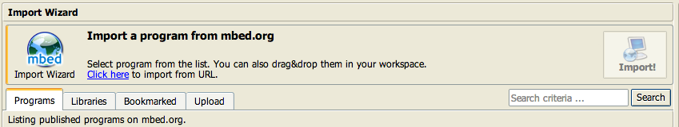
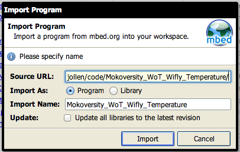
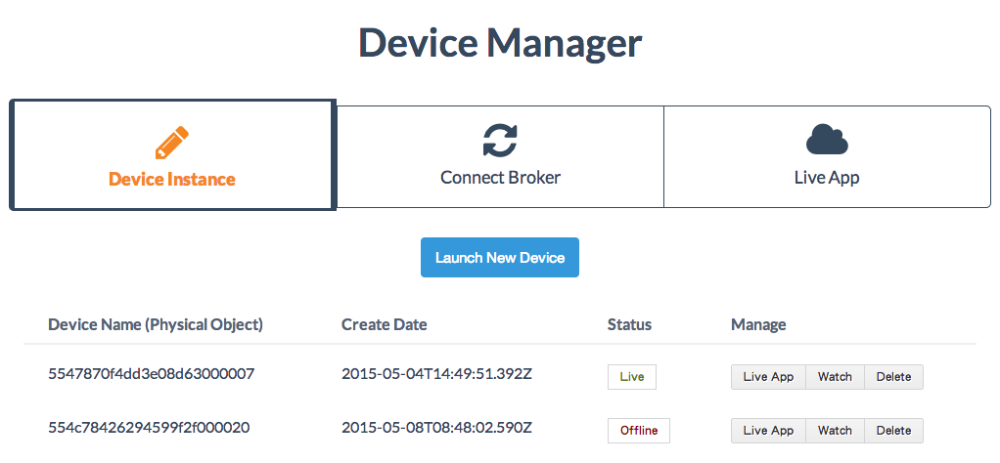

# 第 7 章：Physical to IoT App 懶人包

將 ARM mbed 裝置「封裝」成 web app 只要簡單的 3 個步驟。本文以溫度感測器為例，說明「裝置到 IoT App」的做法。以下步驟使用現成的範例與 SDK 進行，幾乎不涉及實作細節，很適合做為 IoT App 懶人包。

## 準備工作

1. 取得 ARM mbed 開發板，本文使用的 Arch Pro 是由 Seeed Studio 設計與生產的 ARM mbed IoT ethernet kit。
2. 申請 [wotcity.com](http://wotcity.com) 帳號。

## Step 1：匯入 ARM mbed 專案

至 [https://developer.mbed.org/](https://developer.mbed.org/) 申請開發者帳號，再進入 [Online Compiler](https://developer.mbed.org/compiler/) 環境的 Workspace 環境。如圖 1.1。


圖 1.1：mbed 的 workspace

依照以下步驟匯入範例：

1. 點選 workspace 上方選單的 *Import* 選項（
2. 進入 *Import Wizard* 後，點選 *Click here* to import from URL.（如圖 1.2）
3. 輸入專案網址 `https://developer.mbed.org/users/jollen/code/Mokoversity_WoT_Wifly_Temperature/`
4. 匯入成功後，可以在 *Program Workspace* 看到 *Mokoversity_WoT_Wifly_Temperature* 專案，如圖 1.3
5. 將專案展開後，可以找到 *main.cpp* 主程式
6. 完成專案匯入



圖 1.2：Import Wizard



圖 1.3：輸入專案網址

## Step 2：讓 Arch Pro 上網

本文範例使用 Arch Pro + mbed WiFi Shield，請修改以下程式碼：

```
WiflyInterface eth(D1, D0, D5, LED4, "<SSID>", "<Password>", WPA);
```

將 *<SSID>* 修改為 WiFi 熱點名稱；將 *<Password>* 修改為 WiFi 熱點密碼。例如：

```
WiflyInterface eth(D1, D0, D5, LED4, "jollenchen", "12345678", WPA);
```

如果是使用 ethernet cable（RJ-45）將 Arch Pro 上網，只需要少量修改程式碼。將以下程式碼：

```
WiflyInterface eth(D1, D0, D5, LED4, "<SSID>", "<Password>", WPA);
```

修改為：

```
EthernetInterface eth;
```

即可。範例預設使用 DHCP 進行網路組態，如果要手動進行組態（Static IP），請參閱範例裡的註解說明。

## Step 3：取得 Device Name

至 [http://wotcity.com/](http://wotcity.com/) 申請帳號並登入。依照以下步驟取得 Device Name：

1. 點選 [http://wotcity.com/account](http://wotcity.com/account) 頁面左邊的 *Device Manager*
2. 點撃 *Launch New Device* 按扭
3. 系統會建立一個新的裝置
4. 從列表中的 *Device Name (Physical Object)* 欄位 Copy 裝置名稱，如圖 1.4


圖 1.4：取得 Device Name

## Step 4：修改 *main.cpp*

延續 Step 1，將 *main.cpp* 開啟後，找到以下程式片斷：

```
    /*
     * We use WoT.City Websocket channel service.
     * See: https://www.mokoversity.com/wotcity
     */
    Websocket ws("ws://wot.city/object/[Object Name]/send");
    while( !ws.connect() );
    led2 = 1;
```

修改 Websocket 的 URI，將 *[Object Name]* 替換為 Step 2 取得的 Device Name。例如：

```
    /*
     * We use WoT.City Websocket channel service.
     * See: https://www.mokoversity.com/wotcity
     */
    Websocket ws("ws://wot.city/object/5547870f4dd3e08d63000007/send");
    while( !ws.connect() );
    led2 = 1;
```

## Step 5：更新 Firmware

延續 Step 4，點撃選單 *Save* 選項後，再點選 *Compile*。編譯成功後，瀏覽器會自動下載 firmware 檔案（*.bin）。

將 Arch Pro 與電腦連接後，會看到 *MBED/* 資料夾。請注意，Arch Pro 有二個 Mini USB Port，更新 firmware 時，請連接至 Debug Port。

接著將新的 firmware 檔案拉到此資料裡即可，如圖 1.5。更新完成後，請拔除並重新連接 USB，讓 Arch Pro 重新關機。


圖 1.5：Drag and Drop 更新 firmware

## Step 6：開始 Data Push

更新 firmware 並啟動 Arch Pro 後，溫度感測器數據就會開始推送（Data Push）到 Internet。要知道目前的 Data Push 情況，可以使用 WoT.City 的監視看功能：

1. 登入 [http://wotcity.com/](http://wotcity.com/) 
2. 點選 [http://wotcity.com/account](http://wotcity.com/account) 頁面左邊的 *Device Manager*
3. 在列表中找到所使用的 *Device Name*
4. *Status* 欄位會切換為 *Live*，表示目前裝置已連上 Internet，如圖 1.6
5. 點撃 *Manage* 欄位中的 *Watch* 按紐，即可看到即時的推送數據（JSON 格式的文件）



圖 1.6：裝置顯示為 Live

點撃 *Manage* 欄位中的 *Live App* 按紐，可以開啟這個裝置的 web app。目前 WoT.City 的 Live App 功能，暫時只支援溫度感測裝置。未來將可以由使用者自行佈署 Live App。

## Step 7：製作 Web Frontend

Live App 的功能其實是一個 web frontend。想自行打造 Live App 的創客，可使用 .CITY Starter Kit。**tl;dr**: 取得 [.CITY Starter Kit](http://wotcity.com/docs/dotcity-starter-kit)。

.CITY Starter Kit 使用 *Backbone.View* 與 *Backbone.Model* 做為主要的 framework。但在 *render()* 方面，則是不同的設計，對 *Backbone.Model* 也做了小幅度的重構，以支援 Dataset-View 的設計模式。.CITY Starter Kit 的主要特色如下：

* Use *Backbone.Model* to composite streaming data.
* Use virtual dom for view boundary composition.
* Dataset-View framework pattern
* Integrate WoT.City websocket broker service

以上特色實作於 [AutomationJS](https://github.com/wotcity/automationjs)，並整合在 .CITY Starter Kit 裡。